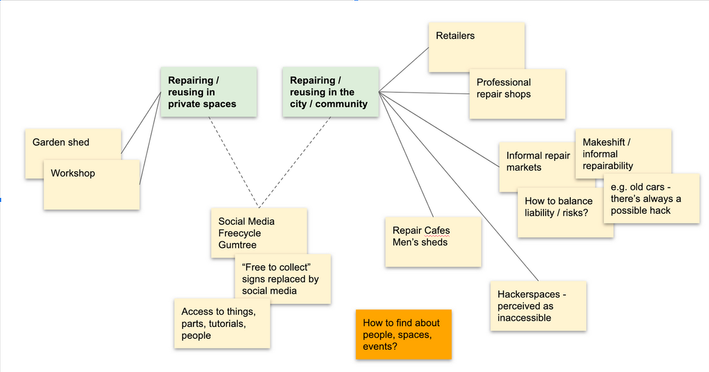
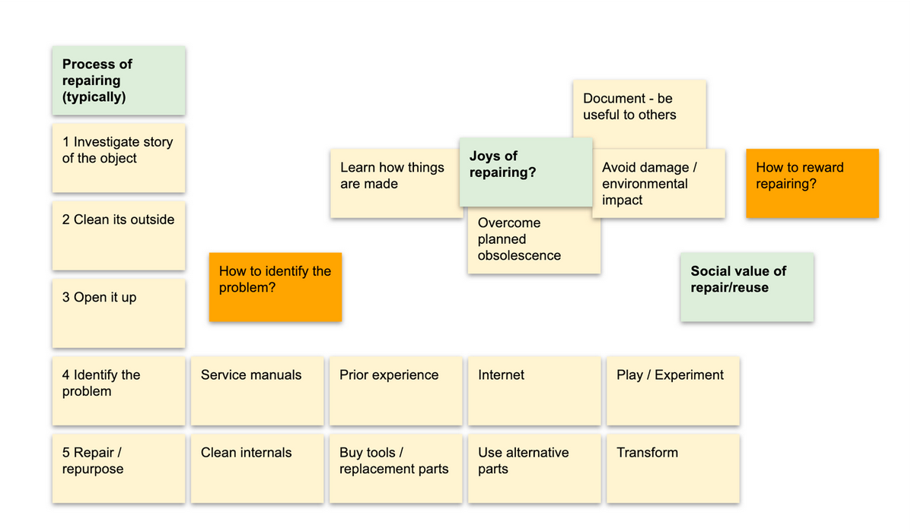
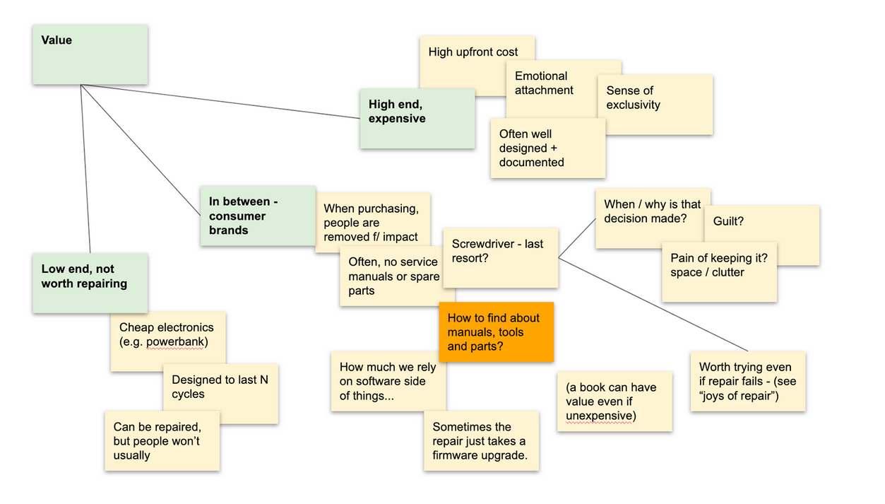
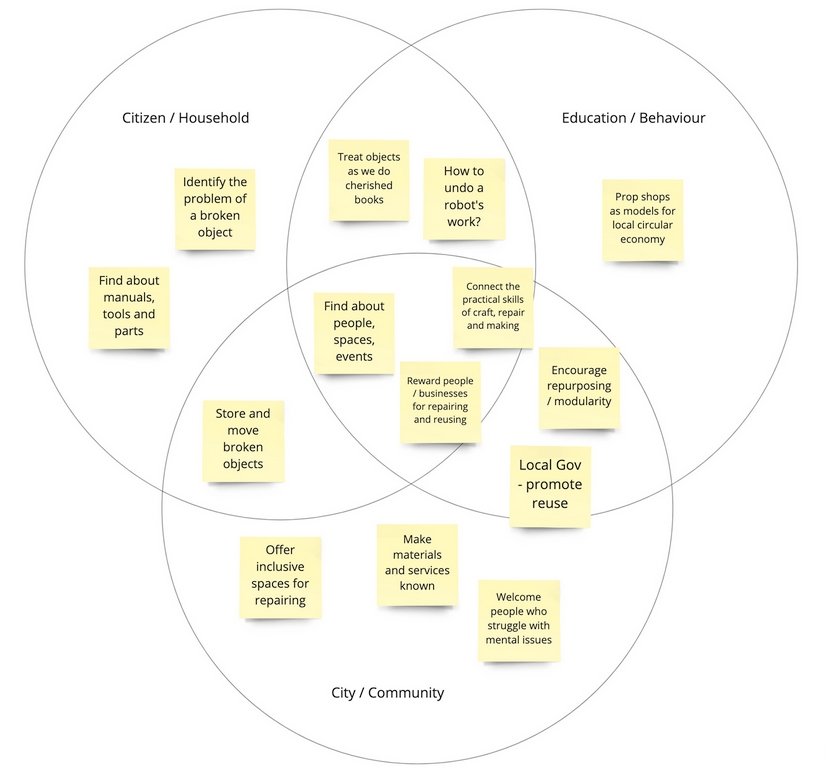

# Waste Prevention in Smart Cities

## Felipe Schmidt Fonseca

## OpenDoTT - October 2020

> “Cities have often been likened to symphonies and poems, and the comparison seems to me a perfectly natural one. They are, in fact, objects of the same kind. The city may even be rated higher since it stands at the point where nature and artifice meet. A city is a congestion of animals whose biological history is enclosed within its boundaries, and yet every conscious and rational act on the part of these creatures helps to shape the city’s eventual character. By its form as by the manner of its birth, the city has elements at once of biological procreation, organic evolution, and aesthetic creation. It is both a natural object and a thing to be cultivated; individual and group; something lived and something dreamed. It is the human invention par excellence.”
> Lévi-Strauss, Tristes Tropiques \[11]

## 1.1. Technology in the city

Urban management and digital technologies are deeply interdependent. As direct mediators of social life, cities and towns are not only the backdrop for technological development. Rather, municipalities are themselves first level regulators, as well as heavy users, of information technologies. New ways to generate and handle data, with direct implications on the life of citizens and local organisations, are constantly being experimented worldwide in locations as diverse as they can be. The way these technologies are designed and deployed, however, is quite opaque.

Scholars in urban studies have explored in depth the often conflictive relationship between local authorities and the society they are supposed to represent in contemporary democracies \[17, 10]. Decisions that impact the lives of local communities are often made without a real acknowledgement of the needs, desires and concerns of those communities.

Those dynamics are even more present when it comes to the deployment of information technologies in cities. What came to be known as “smart cities” arguably operates precisely in that boundary: promising the public opinion an urban life without friction, whilst exacerbating real contradictions \[2, 3]. It can be argued that the mainstream narrative about smart cities is mainly built from the perspective of IT vendors and consulting firms, and adopts their vocabulary and worldview uncritically \[14].

Part of the reason for it may be that the pace of change in the digital realm makes it impossible for local authorities to understand in full what they are signing up for, even less pursue accountable participatory decision processes. Another aspect to bear in mind, however, is that IT firms may well be implementing the very methods they use to disrupt their own markets by testing many simultaneous versions of solutions “out in the real world” (the Lean Startup \[16] offers a simple example of these methods). In that sense, every attempt to deploy, for instance, sensors and actuators networked in dynamic grids of wireless networking to generate and use data, could be treated as a particular experiment that will provide new ways for vendors to test their hardware, software, ethical framing, branding and narrative.

The unbalance in this situation is that local populations are not anymore the beneficiary of technologies, rather becoming guinea pigs of experiments touted as unavoidable. One of the factors mentioned by local groups in Toronto opposing a major development run by Sidewalk Labs, a subsidiary of Alphabet (the holding which also owns Google), is that in every public presentation the project was described differently, which made it very hard to build up the argument to criticise it. The question raised by those groups was whether the population is even allowed to “just say no” \[1]. Sidewalk Labs eventually [abandoned the project](https://www.theguardian.com/technology/2020/may/07/google-sidewalk-labs-toronto-smart-city-abandoned), but the story is worth having in mind to understand the many ways in which the worldview of global IT corporations often diverges from that of local communities.

## 1.2. Research Focus

Among the many areas under the responsibility of local public administration, one in which the contradictory dynamics mentioned above seems to be at its extreme is the handling of waste. Not only is society typically lacking agency in decisions about waste management: it is to a large extent ignorant of what decisions are made. Very few people know what happens to the waste produced by their households and businesses.

Solid waste - the sum of all unwanted materials from households, businesses, community organisations and the public sector - is “inextricably linked to urbanization and economic development” \[22]. Typically the local authority has a provision to handle the waste against charging a tax or fee. Over the last decades, waste management systems have been gradually adopting similar practices all around the world \[22]. That includes separate collection and destination of recyclable materials and general waste. While the latter usually ends up in landfills or incinerated, with luck to generate energy, the former is sent to be turned back into raw materials through diverse industrial processes. There are also those types of materials that need special handlings such as medical, electronic or other potentially hazardous waste.

Most of the practices for handling municipal waste are arguably geared towards making it invisible from the eyes of local societies. While there is an understandable - visceral - discomfort of humanity to face the waste it generates, there is an important discussion to be made when it comes to smart city projects. Many such projects aim at simply increasing the efficiency of municipal services the way they are usually performed - which in itself is already prone to questioning \[7]. Further, they usually do not challenge whether the assumptions these services are based upon are correct. And there’s much to question about current practices of waste management.

First of all, there is the well-established knowledge that waste prevention is to be regarded in principle as more beneficial to society at large than recycling - providing “the highest effectiveness with the lowest cost” \[6]. Many variables exert influence in that, naturally. However, it is important to bring into the discussion the fact that any kind of recycling brings about consequences that are not often present in public conversation. Recycling depends on an intensive use of energy - both for the recycling processes and the logistics required - even more so when it comes to complex materials such as electronics. Recycling also has economic impacts. Turning manufactured goods back into raw materials often equates to losing value, what some call “downcycling” \[12]. Current policy at an international level recommends shifting from a mindset of “waste disposal” towards “resource management” \[21].

Bearing in mind those issues, it is useful to refer to what is sometimes described as “waste prevention”, or “waste avoidance”. Indeed, in recent years there have been important new developments that take into account the idea of reusing materials instead of disposing of them through recycling, landfilling or incineration. The idea of a circular economy points to some possibilities in that direction \[5], as well as growing support both from citizenship and governments to zero waste initiatives. These realities are however totally absent from waste management solutions as proposed by smart city projects.

The main goal of my PhD research is to fill precisely that gap: how should the topic of waste prevention be treated in smart city projects? What would be the social as well as environmental benefits of discovering potential wealth in materials that otherwise end up being discarded? How can the internet of things be used as a tool to leverage the reuse of materials in urban contexts?

I am directing my attention in particular to the reuse of materials in cities and towns through initiatives aimed at and run by local actors. It is a critical take to the way waste management is often implemented by local governments. Instead of increasing the efficiency of waste collection and disposal (usually towards recycling, incineration or landfills), I expect to generate ideas that contribute to avoid as much as possible the very need to manage waste - pushing forward the understanding that a significant amount of materials currently being discarded could still be used, with positive impacts for local society.

## 1.2.1. Research questions

The Internet of Things offers new possibilities to generate, transmit and analyse data on cities. In what ways might these technologies help create waste prevention systems that make the most out of reusable discarded materials - those objects not needed anymore, which are either malfunctioning, broken, wrongly sized, obsolete, or otherwise inadequate?

**Research Question 1 (RQ1):** What prevents more widespread reuse of discarded materials in contemporary cities?

To address RQ1, I will investigate how citizens evaluate and decide - at an individual/household scale - what to do with such objects. A specific focus will be applied on how their maintenance, repair, customizations and transformations happen in private, community and public spaces. I will also explore the individual, cultural and material conditions impacting the decision whether or not to reuse objects. Finally, I intend to understand how those activities may tie in with municipal waste management - and how much are citizens aware of the proper destination of each kind of material.

**Research Question 2 (RQ2):** What are the different actors - formal and informal - involved in reusing material objects at a city scale and how do they operate?

In order to face RQ2, I will seek to understand the similarities and differences between repair shops, scrap stores, charity shops, community repair projects, zero waste initiatives and other similar ones. I am interested in learning whether the people involved in these activities see themselves and their organisations as part of a wider field of urban reuse of materials. In particular, I will investigate how different actors assess the potential value of particular materials. Additionally, I’ll consider the kinds of transformations - whether physical or symbolic - they apply to each material to actualize the potential value it holds.

**Research Question 3 (RQ3):** what current and future digital technologies might help in making local societies reuse a higher proportion of materials that are otherwise discarded?

I will approach RQ3 by considering the possible uses of the Internet of Things - sensors, connected devices, real-time access to trusted databases, among other digital developments - to a) assess the potential value of discarded objects; b) repair and repurpose those objects; c) make those materials reach people or organisations that can put them to good use. I’ll be interested in interrogating what role should the local authority/municipality play in using technologies to encourage the reuse of materials - in terms for instance of regulations, facilities, taxation, education, procurement or others. Furthermore, I’m interested in looking at the implications of reusing materials with the aid of technologies vis-a-vis concerns about privacy, security and health.

## 1.2.2. Research methods

I have adopted a combined approach to acquire a better understanding of the possibilities regarding waste and waste prevention in smart city projects. These started from a review of the literature and relevant projects, which led to the creation of two different design research studies in order to gather data from participants, and finally the creation of concept ideas that responded to the data coming from the studies.

My contextual review aimed to:

- situate smart city initiatives from a critical perspective regarding accountability, democratic participation, environmental concerns and inclusiveness;
- discuss the broad impact of waste and how technologies and structures are used to manage it;
- learn how to better prevent the generation of waste by taking into account a socio-environmental perspective;
- understand the different fields potentially involved with the reuse of materials in an urban context.

The review is discussed in more detail in Section 2.

My research studies were informed by design research practices of engaging with participants in order to tap into explicit knowledge, lived experience and insights. The two studies were framed differently from one another:

- The Repair Journey was designed to understand how decisions and practices about repair and reuse are made at an individual/household level, engaging with Research Question 1 (Section 1.2.1). The Repair Journey is further detailed in Section 3.1.
- The Ecosystem Mapping was conceived to raise a perspective of how materials flow at city level before being disposed of, thus addressing Research Question 2 (Section 1.2.1). More about the Ecosystem Mapping can be seen in Section 3.2.

The concept ideas were created as a more tangible response to the Research Questions and as a way to elicit different modes of engagement with the data generated by the studies. The eight concepts, distributed in three thematic groups, are discussed in Section 4.

As well as generating and analysing data through the contextual review and research studies, I kept as well my own research diaries and a publicly available research blog documenting current readings, events and research studies, as well as reflecting upon projects I was involved with in the past (section 2.3).

## 1.2.3. Additional activities

Along with my literature review, research studies and generation of concepts, during the first year, I attended training to:

- Learn about design research as a means to generate and analyse primary data from people in their fields of knowledge or experience.
- Get an overall understanding of specific themes such as waste management and cooperativism.
- Acquire skills on research, academic writing, publishing, ethics, project management and related topics.

I have attended events in fields of knowledge such as smart cities, repair culture, open-source, artificial intelligence, and digital arts:

- Beyond Smart Cities Today, Rotterdam, September 2019.
- Reparatur Festival, Berlin, September 2019.
- Mozfest, London, October 2019.
- Neon Festival, Dundee, November 2019.
- Transmediale, Berlin, January 2020.
- COGX, online, June 2020.
- HCI Summer Festival, online, June 2020.
- Future Focus: Art Hack Practice, online, June 2020.
- Fixfest UK, online, June 2020.
- Data Cities, Berlin, September 2020.

I was also a speaker at the following events:

- Talk “Transforming Matter” at Reparatur Festival, Berlin, September 2019.
- Respondent at the panel “What was the Network?” at E2E Symposium, Berlin, January 2020.
- Presentation “Repair Diaries”, online, April 2020.
- Talk “Repair and Reuse in Urban Contexts” at Fixfest UK, online, June 2020.
- Workshop “Reuse, Recycle, Repair - Hacking waste management for the smart city” at Data Cities conference, Berlin, September 2020.

# 2. Contextual review

In order to acquire a sufficiently broad understanding of the issues involving smart city projects and their potentialities for my particular research focus on waste prevention (see Section 1.2), I have approached a multi-sided approach:

- A review of literature on smart cities, particularly from a critical standpoint in regards to democratic participation, citizen’s interests and transparency;
- A review of literature and initiatives related to waste prevention, circular economy and other related topics;
- A recollection of projects I have been involved with in the past in subjects such as repair movements, digital crafts, social aspects of reuse and repair and others, as discussed in section 2.3;
- Participation - both as part of the audience and speaker - in events about smart cities, urbanism and repair culture;
- Attendance of online courses about waste management and platform cooperativism.

As the research evolved, I kept a blog and an online collection of links, both of them documenting some of my insights, findings and notes along the way. This way of publishing in the open allowed me to experiment with different lines of thought, share my work early on with interested parties and at some points get recommendations of other projects, literature and framings I should pay attention to.

## 2.1. Literature - theme groups

During the first year, I have looked for references that would help define what fields would my investigation involve, what my particular focal point would be and how best to frame my research questions. I went through academic indexing databases and industry reports, publications by community and activist groups as well as conference proceedings on smart cities, IoT and waste. I have used keyword search, looking for critical approaches to smart cities, waste management and prevention, and the way technology makes its way into public administration. I have identified nearly 400 documents that can contribute to the research focus I am pursuing at this point (Section 1.2), of waste prevention in smart cities. The documents can be grouped in the following categories:

- Appropriate and Grassroots Technologies
- Circular Economy, Repair Culture, Maintenance, Waste Prevention
- Commons: Collective Management, Cooperativism
- Critique of the Smart City, Urban Studies
- Databases, Blockchain and Online Ledger Systems
- Green New Deal
- Internet of Things
- Living Labs, Citizen Innovation
- Making, Craft, Digital Fabrication, Hackerspaces
- Methods: Design Research, Ecosystem Mapping, Diary Studies, Design Fiction
- Sustainability, Environment, Climate
- Techno-politics
- Waste Management and Recycling

## 2.2. Discussion of Literature

### 2.2.1. Smart Cities and Critical Urbanism

While the use of digital technologies in public administration is arguably not new, its current incarnation - particularly around the term “smart city” - has emerged and was consolidated in the last ten to fifteen years. Stemming originally from the industry of information technology and its branches in the procurement of services for the public sector, the idea of smart cities gradually entered the vocabulary of national as well as local governments. It, however, carries a particular worldview tributary of its origins, and that has deep implications.

As smart city projects started to be widely advertised and in some cases deployed, its narrative would usually focus on a somehow limited number of areas: public transportation, usually control of fleet and traffic lights; camera surveillance for public security; energy management and public lighting; waste collection and recycling; weather sensors and disaster prevention; inventory and resource management. Existing literature covers most of these subjects from varied perspectives.

Critique of industry-led smart cities projects is largely found on Adam Greenfield’s work \[7, 8]. Greenfield states that the IT industry built its vision of smart cities around projects of brand new urban settings erected up in areas previously empty. That allowed them to avoid the need to deal with the many layers of unsolved or conflicting issues present in any urban scenario, and focus instead on increased efficiency of urban services. An intention to frame smart city projects through a lens of power relations is found on Datta and Oderdaal \[4].

IT vendors and local authorities are not the only parties interested in discussing how cities are developed. Indeed, thinkers and practitioners from multiple fields of knowledge have put their efforts into exploring what cities are and how they develop - often leading to dimensions and aspirations other than those of control and efficiency. Relating to more comprehensive urban studies looking at global cities \[17] may offer a multi-layered perspective of actual urban issues that could be tackled from a critical take on smart(er) cities. While Richard Sennett \[19] opposes closed cities to open ones, proposing that the latter will enable a more just and abundant society to develop.

### 2.2.2. Waste and material flows in the city

As I read about the ideas in which smart city initiatives are based and the problems these ideas entail, I couldn’t help noticing the particular superficiality in most of what was said about waste management. There is a huge gap between current best practices and horizons in the environmental sector and the proposals being pushed forward by IT vendors and adopted in an uncritical way by public administration bodies.

A lot is said about “smart bins”: sensor-equipped waste containers that allow for more effective planning of pick-up by trucks and lorries \[6, 23]. Even if that can indeed effect change in terms of costs, carbon emissions and, say, traffic, it does not address many of the real issues involving waste in contemporary cities.

Smart city projects seem to suggest that waste management is only a matter of making discarded materials disappear as soon as possible from the public view and be sent to one out of three destinations - recycling, incineration or repair. There are however many downsides to such simplistic practices. To start with the illusion of recycling. A recent news report from USA’s National Public Radio titled “Waste Land” exposed the fact that recycling plastics just does not work the way it is done today.

McDonough and Braungart \[12, 13] argue that biological and technical “nutrients” can be fed back by adopting a systemic approach that would close the gaps in industrial production, but that requires great changes in the way products are designed and dealt with. Their work was one of the main references in the construction of the concept of a “circular economy” \[5]. According to this understanding, there is an enormous potential for the industry to design products taking into account what will happen to them once they are not used anymore.

However relevant the perspective adopted by industry and policymakers on creating a circular economy in the near future by influencing product design and supply chain, the enormous volume of waste already generated over decades of economic growth remains unsolved. There are however a number of local initiatives experimenting with the idea of zero waste: small businesses and community organisations that work to extend the lifetime of products. It can be by creating secondary flows for unused goods such as clothes, furniture, appliances or any other objects - either donating or re-selling. In other cases, it is about repairing broken products, or upcycling - making them fit for purposes diverse from the original ones.

## 2.3. Past projects and ongoing conversations

Besides looking at existing scholarship and real-world experiments, my research also looks back into projects I’ve been involved with in the past that shaped the interest in promoting the reuse of materials as a way to effect positive local impact in environmental as well as social and economic terms.

I have long been involved with activist networks in Brazil, some of which worked directly on reuse and repair. The MetaReciclagem network of which I was one of the founders and main articulators had at once more than ten laboratories in different regions of the country that received discarded computers and refurbished them for social purposes using free/open software. I was part of a collective that successfully pressured Brazilian Congress to include electronics in the country’s solid waste bill passed in 2010 after being discussed for 19 years. I would later work on a consultancy firm advising the Ministry of Planning on how to put the new law into effect.

As well as working on policy, I have spent some time exploring the cultural and social aspects of reuse and repair. I was invited to conduct design and teaching residencies at a Festival in Finland, an University in Qatar, a nonprofit in France, and other similar settings.

During the first year of research, I have revisited documentation about some of those projects. That allowed me to re-establish contact and create new connections with researchers and activists working in fields related to my research focus. I got involved with organisations engaged with repair culture, platform cooperativism, smart city and urban issues in the UK and Germany. Some notes about these reflections and exchanges are published in my research blog. I keep also a growing list of relevant bookmarks related to my research topic and questions.

## 2.4. Courses

Adding to my attempts to better understand the fields my research is taking me to, I have attended two online courses this year. The first one, offered by the École Polytechnique Fédérale de Lausanne and Eawag through the platform Coursera, is called “Solid Waste Management in Developing Countries”. The other, offered by The New School in partnership with the Mondragon University, is “Platform Cooperativism Now”. While the former offered a systemic view of best practices on waste management in diverse settings, the latter explored the potentiality of digitally-organised cooperativism to face some of the contemporary challenges in economic as well as social terms.

# 3. Research Studies

As well as a review of literature and projects relevant for my research focus, I have created two design research studies in order to contribute to a better understanding of reuse in urban contexts. The Repair Journey aimed at identifying individual behaviour towards things that can be reused, while the Ecosystem Mapping expected to understand the kinds of structures in place for reusing materials in contemporary cities.

## 3.1. Repair Journey

The Repair Journey was designed to investigate ways in which materials that are broken, obsolete or otherwise inadequate can be repaired, adapted or transformed in urban contexts. In particular, I expected to address my Research Question 1 (section 1.2.1) by understanding how the value of an object is perceived in different situations, and how accessible are the possible ways to handle or transform it.

Those who volunteered to participate were asked to start a repair diary of one object that was either broken, malfunctioning or inadequate. Each participant was able to choose the object their diary would focus on. It could be an object they were currently interested in exploring or some notable experience they have had in the past. During some weeks, participants would be asked to reflect upon the value of the object they chose, in what ways it could be considered usable and how easy it was to repair or repurpose it. Stories of failed attempts were to be considered as relevant as successful ones.

By the end of the period of exploration, the participants met for a closing workshop. During the workshop, they were asked to report how their journeys went, as well as to discuss what would need to be changed in their city or town to make the reuse of materials easier, more effective and more enjoyable. The main goal of the workshop was to understand what should be different in cities in order to allow local society to reuse more of the materials they currently discard.

By its own nature, this study focused more on the perception of individuals about reusing materials. At some points, I decided to drive the conversation and ask more directly what they felt should be the role of the local government. Elsewhere I allowed discussions to take their own pace.

## 3.2. Ecosystem Mapping

The goal of the Ecosystem Mapping was to understand how broken or discarded materials circulate in the urban context, as well as where and how they are handled and transformed, as desired as a response to my Research Question 2 (section 1.2.1). I was looking particularly into how potential value is assessed in different kinds of facilities, and what types of equipment, methodologies and data sources can aid in that. I expected to do that by interviewing managers and staff working at places responsible for solid waste treatment, as well as organisations and companies that repair, repurpose or handle donations of different types of materials.

The COVID-19 lockdown in place during the whole of my data collection period made it difficult to visit and interview staff members from waste management, or volunteers in charities. I managed however to recruit participants for online or phone interviews who brought me a sufficiently diverse set of perspectives: a local manufacturing / design shop; a nonprofit organising zero waste initiatives; a second-hand shop / cash advancer; a scrap shop with an artists' studio attached; a data scientist creating ways to visualise waste data.

## 3.3. Research Data

### 3.3.1. Themes

Upon analysing the diaries, email communication, workshop and interviews against the notes I made myself, I have identified recurring topics and issues, as shown below.

There are different elements involved in repairing and reusing materials in private spaces against collective/open ones. One important aspect has to do with trust. Participants expressed it was hard to know who they could trust to repair things.

The process of repairing or transforming objects can often be one of learning and experimenting. There is a sense of identifying a problem and acting upon it. Another recurring aspect was one of joy, beyond the mere restoring of functionality. And that relates to a common question: how to reward the reuse of materials and subsequent extension of their lifetime?

Then there is an important discussion about value. What are the characteristics of objects which their users will want to maintain and repair, and what are the characteristics of ones that are easily discarded? Not every object has the same relation between cost, use and perceived value. There is also the question of how to find information on repairing things.

### 3.3.2. Target groups

Even though the boundaries are somewhat blurred, I could identify four different target groups from my research studies. There is some overlap between them, but each can arguably be understood as a perspective that poses a different emphasis on the way materials are to be handled and circulate: citizen, community, professional reuse, public sector.

**Citizen**

- Individual/household who has things that are broken, wrong-sized, inadequate or unwanted.
- Individual/household who is interested in acquiring trusted and affordable second-hand goods.

**Community**

- Group or organisation willing to offer second-hand goods to communities, or to use second-hand goods to generate income to community members.
- Volunteer group or not-for-profit organisation organising repair cafes, clothes swaps and other zero-waste projects.

**Professional Reuse**

- Social enterprises working on the selection, transformation and redistribution of second-hand goods.
- Professional workshops dedicated to repairing, maintaining, customizing and upcycling used objects.

**Public Sector**

- City council, or similar official government body, looking into social, environmental and economic benefits of encouraging the reuse of materials at a local scale.
- Regional or inter-municipal public organisations tackling environmental issues.

## 3.3.3. System

In trying to sketch a systemic view of reuse, repair and circulation of second-hand goods in cities, I have identified six groups of operations to take into account:

- Connect

  - Sources of materials
  - Transformation
  - Destination - shoppers, communities, recycling

- Urban presence

  - Workshops / Local manufacturing
  - Donate / Sell
  - Repair
  - Buy / Be given

- Systems approach

  - Business models for different actors
  - Commons governance
  - Social need - Opportunities

- Change

  - “Trending” vs. “Ethical decision”
  - Behaviour / Education / “Niceness”
  - Concrete incentives - Policy / Taxing
  - Autonomy / Sovereignty
  - Islands / Rural areas - resourceful

- Data on Zero Waste / Repair / Reuse

  - Generate / Integrate
  - Manage
  - Publish
  - e.g. charity shop refuse

- Stories / Curation / Presentation

  - Find information
  - Remove information

## 3.3.4. Insights

By connecting themes and target groups, I was able to collect insights to feed the design process and inspire design concepts. I have grouped the insights into three loose categories: citizen/household; education/behaviour and city/community.

# 4. Design Concepts

The concept ideas shown here are my responses to issues and insights identified while exploring the idea of waste avoidance in cities and towns, and how initiatives under that perspective are usually absent from smart city projects. Each concept connects differently to at least one of the four target groups.

These ideas are not meant to be radically new. Rather, the intention is contributing to building a systemic, commons-based approach that allows society as a whole to benefit from the potential value that can be generated through secondary flows of matter.

The concepts can be grouped into three main categories:

- Data and Things

  - Universal Registry of Things
  - Point and Reuse
  - Save this Thing

- Transparency and Visibility

  - Make Waste Visible
  - Reuse Dataset

- Reuse in the City

  - Reuse Commons
  - Transformation Lab
  - Reuse Bin

## 4.1. Universal Registry of Things

An open database about objects, to support the reuse (repair, recirculation, upcycling) and help evaluate the potential of objects for secondary markets. The Universal Registry of Things is a trusted source of information about how to reuse objects. It covers information about repair, customisation and repurposing of virtually any kind of thing.

Examples of data to be featured:

- Manufacturer
- Support and end-of-life policy;
- Versions and official recalls;
- Price of the object offered online (new/used);
- Materials;
- Service manuals;
- Parts;
- Repair tools;
- Tutorials of repair and upcycling;
- Examples of reuse;
- How to dispose of.

## 4.2. Point and Reuse

An app that allows users to take a picture of any object, match it against theUniversal Registry of Things and instantly evaluate or learn about its potential for reuse and upcycling The app allows citizens, members of zero waste initiatives, repair professionals or anyone interested to quickly assess the potential value of an object, and find information on how to reuse it.

Functionalities:

- Make/upload picture

  - server-side computer vision matches against the database)

- Browse by brand or type

- Search

## 4.3. Repair this Thing

A website with a geo-referenced open directory of shops, professionals and groups that offer alternatives to reuse materials.

Save this Thing is a geo-referenced and user evaluated open directory of repair professionals, zero waste initiatives (community repair, upcycling, swap shops, etc), craftspeople, hardware stores, maker spaces, charity shops, recycling points, etc.

## 4.4. Make Waste Visible

Urban interventions exposing the volume of waste generated by towns and cities. Many projects in the urban waste field adopt the perspective of making waste disappear as efficiently and quickly as possible from citizen's eyes. Despite the good intentions, this approach might make local societies unaware of the volume of waste it generates, and by extension to the cost and socio-environmental impact of managing it.

Invite artists, designers and activists through residence programs, hackathons and commissions to inform local populations about the volume of waste generated, reused and recycled.

## 4.5. Reuse Dataset

Open Dataset about different kinds of reuse of materials in urban environments.** **There is strong evidence that oftentimes recycling is not the most appropriate solution for waste, particularly when there are still potential uses for the discarded materials. However, there is little available data to inform society of the social, economic and environmental outcomes of reuse when compared to data about recycling.

## 4.6. Reuse Commons

Ecosystem for the collective stewardship of post-consumption materials. Reuse Commons is a model for a multi-stakeholder body governing the reuse of discarded materials in a city or region.

The reuse commons integrates transformation labs, lost and found services, reuse cabins and similar initiatives, community reuse projects (repair cafes, zero waste and material redistribution projects), reuse bins and reuse datasets.

Potential members:

- Citizens/households.

  - Donating / Selling goods to the commons and being able to track their destination / social impact.
  - Having access (affordable prices/donation schemes) to trusted second-hand goods - provenance and individual history.
  - Possibility: reward donors with credits to acquire other goods.

- Community reuse initiatives - repair cafes, men's sheds, charity shops,_ressourceries_, clothes swaps, zero waste projects,

- Repair/reuse services - SMEs and social enterprises making their services known. Smartphone and Laptop repairs, tailors, bike shops, automobile maintenance,

- Upcycling / Antique / Design shops

- FabLabs / Makerspaces

- Council / Local Authority - reuse cabins, collection of large items, house clearances, renovations of schools and public buildings.

**Economic model**

One of the main motivations behind the reuse commons is to create ways for people and organisations to be rewarded for reusing materials themselves, or allowing others to reuse - instead of discarding things that would then be "downcycled" at best.

Membership model - people, businesses and organisations sign up to participate in the commons. Every object they put into the system is registered. When it is reused or upcycled, the commons grows. Credits from donations of materials can be used to acquire other goods.

## 4.7. Transformation Lab

Blueprint of facilities for reuse / upcycling of materials in urban contexts.

Plans for setting up urban infrastructure for reuse / upcycling / redistribution of used materials. Recommendation of equipment, data sources and processes. Plans for creating new kinds of devices and equipment that allow the reuse of materials.

Transformation Labs are oriented toward social and environmental outcomes. There may be different types of Transformation Labs that carry out diverse activities, according to the potentialities of different parts of the city.

## 4.8. Reuse Bin

Track what is made of your donations.

A system of kerbside bins that allow citizens to donate unused objects. Each unit generates a tracking code which allows donors to learn where the objects are taken to, what is made of them and their social/economic impacts along the way.

# 5. Next steps

I have started my first year of research working to acquire a sufficient wide perspective of the advantages and shortcomings of smart city projects, bearing in mind the desire to bring about benefits for the whole of society and the environment. As I decided to narrow down on a perceived gap of initiatives pushing forward the idea of waste prevention within smart cities, I have then conducted research activities that allowed me to understand more about repair, reuse and circulation of second-hand goods in contemporary urban contexts. I then worked on design concepts seeking to open the discussion back up.

I move to Berlin for the second year expecting to increase my knowledge of technical, conceptual and political aspects of IoT, and how they can be deployed in order to promote the prevention of waste in smart city projects. I will lean on the findings and developments of the first year, combined with new research and training to be pursued in the coming months. By the end of the second year, I hope to have at least one robust prototype deployed and tested in a real-world scenario.

Two main branches of training are planned for this year:

- Internet Health, offered by our host organisation Mozilla Foundation. Mozilla is well known for their work and advocacy for ethical ways to develop digital technologies. That is based on open and collaborative methodologies, transparency and accountability. I expect to incorporate those themes into my research, weighing the relevance of the concept ideas I have created against the backdrop of trustworthy technologies brought forth by Mozilla.
- Prototyping Technologies, offered by OpenDoTT consortium member Officine Innesto. Officine Innesto are knowledgeable in bridging the digital realm and the physical world. They are engaged with the Arduino community and other contexts active in the field of IoT. I will lean on the Officine Innesto’s skillset to design and prototype technologies that help to promote waste prevention in urban contexts.

In parallel to the training activities, I will be looking back on the concept ideas developed in the first year. I plan to adopt an open and collaborative methodology inspired by Mozilla to evaluate which ones of the concept ideas have the potential to be refined and prototyped within the timeframe of OpenDoTT. For that, I expect to engage with a community of social and environmental initiatives active in Berlin, for instance, circular economy projects, critical takes on smart cities, ethical startups and the repair movement. Through my first year, I have already established contact and exchange with relevant social actors operating in those fields. Examples are Rundtisch-Reparatur, Disruption Network Labs, Citylab Berlin, Zebras Unite Berlin, Platform Coops Germany, Transmediale Festival and others.

Once I have a clear idea of which concept ideas are both relevant and feasible, I will turn the concepts into co-designed prototypes not only in terms of concrete existence but understood within a systemic perspective as well. I will then perform further fieldwork in order to understand the behaviours elicited by the prototypes and the impact they have on my research focus moving forward.

I hope to be able to spend more time with participants and go deeper in conversations than I was able in the first year. That of course needs to be balanced against health and safety measures in place as the COVID-19 situation evolves, as well as other concerns. On the one hand, I foresee some difficulties engaging with participants due to my limited knowledge of the German language and the fact that I’m affiliated with a foreign University. On the other hand, the initiatives that can arguably be described as working on waste prevention in Berlin are numerous, diverse and very active. The Mozilla Foundation has a reputation for promoting ethical and sustainable practices, which can possibly help to recruit and engage participants.

By the end of the second year, I will have developed concrete research outcomes, as follows:

- Technology demonstrators showing an understanding of the concrete possibilities of the Internet of Things and how to put them to use.
- Further developed co-design IoT concepts incorporating another round of fieldwork and ideation.
- Documentation - both technical as well as conceptual - of the prototype or prototypes developed during the year.
- Datasets of prototype deployment with data generated and analysed.
- Workbooks covering the activities performed in the second year, with a focus on open technologies.

In addition to those, I expect to write up, present and prepare to publish an account of the gap in smart city literature when it comes to waste prevention. Planning ahead for the third and final year of the project, I will also use my time in Berlin to learn more about European and international legislation and best practices that my proposals of reusing materials in urban contexts will likely depend on moving forward.

## Draft Timetable

|                                    | Q4 2020 | Q1 2021 | Q2 2021 |
| ---------------------------------- | ------- | ------- | ------- |
| Internet Health Training           | X       |         |         |
| Prototyping Technology Training    | X       |         |         |
| Refine concept ideas               | X       | X       |         |
| Engage with local actors in Berlin | X       | X       |         |
| Technology demos                   |         | X       |         |
| Design research fieldwork          |         | X       | X       |
| Co-design IoT concepts             |         | X       |         |
| Analysis and documentation         |         |         | X       |
| Workbooks and datasets             |         |         | X       |

# 6. References

\[1] Ahmed, N., Claudel, M., Ebrahim, Z., Pandolfi, C. and Wylie, B. eds. 2019. Some thoughts… https&#x3A;//some-thoughts.org/.

\[2] Cardullo, P., Di Feliciantonio, C., Kitchin, R. 2019. The Right to the Smart City. Emerald Publishing.

\[3] Datta, A. 2015. New urban utopias of postcolonial India: ‘Entrepreneurial urbanization’ in Dholera smart city, Gujarat. Dialogues in Human Geography. 5, 1 (2015), 3–22. DOI:https&#x3A;//doi.org/10.1177/2043820614565748.

\[4] Datta, A, Odendaal, N, 2019. Smart cities and the banality of power. Environment and Planning D: Society and Space 37, 3: 387–392. https&#x3A;//doi.org/10.1177/0263775819841765

\[5] Ellen MacArthur Foundation. 2019. Circular Economy in Cities. https&#x3A;//www.ellenmacarthurfoundation.org/our-work/activities/circular-economy-in-cities.

\[6] Esmaeilian, B., Wang, B., Lewis, K., Duarte, F., Ratti, C. and Behdad, S. 2018. The future of waste management in smart and sustainable cities: A review and concept paper. Waste Management. 81, (Nov. 2018), 177–195. DOI:https&#x3A;//doi.org/10.1016/j.wasman.2018.09.047.

\[7] Greenfield, A. 2013. Against the smart city: The city is here for you to use. Do projects.

\[8] Greenfield, A. 2017. Radical Technologies: the design of everyday life. Verso Books.

\[9] Lane, R., Gumley, W. 2018. What Role for the Social Enterprises in the Circular Economy? in: Unmaking Waste in Production and Consumption: Towards the Circular Economy. September (2018), 143–157. DOI: https&#x3A;//doi.org/10.1108/978-1-78714-619-820181012.

\[10] Lefebvre, H. 1996. Writings on Cities. Blackwell Publishers.

\[11] Lévi-Strauss, C. 1955. Tristes Tropiques. Criterion. https&#x3A;//archive.org/details/tristestropiques000177mbp.

\[12] McDonough, W., Braungart, M. 2002. Cradle to Cradle. North Point Press.

\[13] McDonough, W., Braungart, M. 2013. The Upcycle. North Point Press.

\[14] Morozov, E., Bria, F. 2018. Rethinking the smart city: Democratizing Urban Technology. Rosa Luxemburg Stiftung New York Office.

\[15] Norman. D. 2020. I’m an expert on complex design systems. Even I can’t figure out recycling. https&#x3A;//www.fastcompany.com/90452707/im-an-expert-on-complex-design-systems-even-i-cant-figure-out-recycling.

\[16] Ries, E. 2011. The Lean Startup: How Constant Innovation Creates Radically Successful Businesses. Crown Publishing Group.

\[17] Sassen, S. The Future of Smart Cities. 2011. http&#x3A;//opentranscripts.org/transcript/future-of-smart-cities/

\[18] Sennett, R. 2008. The Craftsman. Yale University Press.

\[19] Sennett, R. 2018. Building and Dwelling: ethics for the City. Allen Lane.

\[20] UN-HABITAT. 2011. Collection of Municipal Solid Waste in Developing Countries. United Nations Human Settlements Programme. https&#x3A;//ccacoalition.org/en/resources/collection-municipal-solid-waste-developing-countries.

\[21] UNEP. 2016. Global Waste Management Outlook. United Nations Environmental Programme. DOI:https&#x3A;//doi.org/10.18356/765baec0-en.

\[22] World Bank. 2012. What a Waste: A Global Review of Solid Waste Management. World Bank. https&#x3A;//openknowledge.worldbank.org/handle/10986/17388.

\[23] Zanella, A.. Bui, M., Castellani. A., Vangelista L., and Zorzi. M. 2014. Internet of Things for Smart Cities. IEEE Internet of Things Journal 1, 1: 22–32.  
