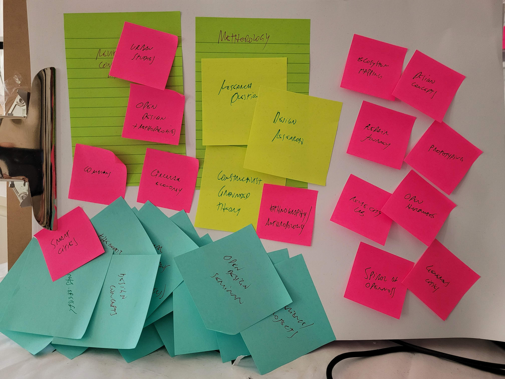

# Thesis structure

The outline below was informed by reflection, meetings with supervisors and conversations with colleagues and other researchers. It is still work in progress and will likely change as the final year develops.

1. A critique of smart cities
2. Excess materials in the city
   2.1. Alternative economics
   2.2. Reuse: Repair, Maintenance, Upcycling, Re-circulation
   2.3. Making and fabrication
3. Research Questions
4. Methodology
   4.1. Design research
   4.2. Open design
5. Research studies
   5.1. Ecosystem Mapping
   5.2. Repair journey
   5.3. reuse.city
6. prototyping
   6.1. thingwiki
   6.2. E-I
   6.3. Transformation Labs
   6.4. reuse.city
7. Analysing research outputs
8. Final discussion
   8.1. Spiral of openness
   8.2. Generous cities

An updated copy of this document, added of references, descriptions and other parts, will be available as it evolves in the following URL:

https://github.com/reuse-city/wiki/blob/main/opendott/northumbria/AP2/AP2-thesis-structure.md

## 1. A critique of smart cities

The first section situates my research in relation to the smart city discourse. To that effect, I will weave a critical take on how IT corporations, public authorities and government agencies often adopt a view that ignores contemporary understanding of urban issues.

**Main argument:** most of the usual depictions of smart cities adopt a very superficial understanding both of what cities are and what "smart(ness?)" means.

I will discuss cities by resorting to literature on urban studies, particularly authors influenced by Henri Lefebvre's take on the "right to the city". According to this line of thinking, cities are not only physical structures managed by governments and the corporations they hire. Social-economic variables, as well as cultural, environmental and political, must be taken into account in order to understand the dynamics involved in imagining, understanding and transforming contemporary cities (as well and villages and rural areas, by the way). Some references I intend to use to reflect on such issues are:

- The right to the city - Henri Lefebvre.
- Global cities - Saskia Sassen.

References of concrete contemporary projects that experiment with democratic forms of participation i urban planning will also be used as examples.

I will then address the limitations of the adjective "smart" as applied to smart city projects. This will be based on critical discussions on smart cities, with references such as the following:

- Against the Smart City, Adam Greenfield.
- Authors and researchers involved with the seminar Beyond Smart Cities Today (Rotterdam, 2019) - Rob Kitchin, Ayona Datta, Paolo Cardullo and others.

Special attention will be given to re-balancing the narrative about smart (or better in other senses) cities by guaranteeing the participation of local society - in the form of community groups, social enterprises, activits groups, small businesses and others - in decision-making, governance and accountability.

### References

1. @brennerCitiesPeopleNot2012
1. @cardulloSmartUrbanismSmart2018
1. @dattaSmartCitiesBanality2019
1. @grahamHowRunCity
1. @greenfieldSmartCity2013
1. @harveyRebelCitiesRight2019
1. @hubbardKeyThinkersSpace2010
1. @kitchinCitizenshipJusticeRight2019
1. @lefebvreKeyWritings2017
1. @sassenFutureSmartCities2011

## 2. Excess materials in the city

In the second section I intend to promote critical discussion to the specific topic of waste in contemporary cities. My starting point already is one of overcoming the usual understanding of waste management towards one of waste prevention. This perspective is informed by literature - both academic and reports by public bodies and agencies. They propose that the usual destinations of discarded materials - recycling, incineration and landfilling - all have negative impact in environmental as well as in economic terms. The recent COP-26 in Glasgow can attest the urgency of de-carbonising as well as to how much policy discussions are still insufficient - as most of the discourse on waste is still focused in reaching recycling targets.

I will then explore literature and case studies related to different aspects of reuse, in the following topics:

 - Alternative economics
 - Reuse: Repair, Maintenance, Upcycling, Re-circulation

### 2.1. Alternative Economics

Here I will discuss in what forms can waste prevention be part of systemic change in economic systems, and what the implications are.

This section will be informed by publications such as the following:

 - Circular Economy - reports by Ellen Macarthur Foundation, EU and other international bodies
    - Aside from briefly describing the circular economy, I will mention critical discussions found in books such as "Circular Economy and the Global South". I have already written in a blog post on "beyond circularity" and will incorporate parts of that in this section.
 - The value of everything, Mariana Mazzucato - not 100% on-topic, but still important to raise the importance of public investment in order to promote innovation and change.
 - Doughnut Economy, Kate Raworth - one attempt to reconcile economics with social and environmental questions.
 - Commons (Elinor Ostrom and other authors).
 - Platform cooperativism, alternative ownership models.

#### References

1. @mazzucatoValueEverythingMaking2018
1. @raworthDoughnutEconomicsSeven2017
1. @sahlinsStoneAgeEconomics2020
1. @schroderCircularEconomyGlobal2019
1. @thackaraHowThriveNext2017
1. @websterCircularEconomyWealth2017

### 2.2. Reuse: Repair, Maintenance, Upcycling, Re-circulation

Also

  - Campaigns on the right to repair
  - Restart Project
  - Tales of Care and Repair, seminar Nov 2021

#### References

1. @baker-brownReuseAtlasDesigner2017
1. @crockerUnmakingWasteProduction2018a
1. @franklinRadicalMatterRethinking2019
1. @grahamOutOrderUnderstanding2007
1. @jacksonRethinkingRepair2014
1. @mcdonoughUpcycleSustainabilityDesigning2013
1. @minterSecondhandTravelsNew2019
1. @novaDrSmartphone2021
1. @pirsigZenArtMotorcycle2014
1. @sobeyUnscrewedSalvageReuse2011

## 3. Research Questions

Attempting to frame my theoretical journey. Am I looking to build grounded theory? How and why?

For now (22.12.2021) I am still to decide on one or more of the following (or something else still):

 - skills and abilities around reuse. can technology help?
 - generous cities, on a conceptual take. how to promote them?
 - transformation labs - building blocks of generous cities?
 - spiral of openness - anticolonial take on open design (perhaps the most theoretical of these alternatives).

## 4. Methodology

### 4.1 Design research

The bases of my first research studies.

### 4.2. Critical Open Design

 - Open P2P Design - Massimo Menichinelli
 - Post-colonial, decolonial, anticolonial
   - Krenak, Ideas to postpone the end of the world
   - Françoise Vergès, [Capitalocene, Waste, Race, and Gender](https://www.e-flux.com/journal/100/269165/capitalocene-waste-race-and-gender/)

## 5. Research studies

 - Year 1
   - Ecosystem Mapping
   - Repair journey
 - Year 2
   - reuse.city

### 5.1. Ecosystem Mapping

### 5.2. Repair journey

### 5.3. reuse.city online co-design lab

 - [reuse city lab](reuse-city-lab.md)

## 6. Prototyping

From studies to concept ideas, to prototyping. Eight original concept ideas, three derived concepts in the second year.

Discussion about the relevance of prototyping and its limitations:

 - Gambiarra: the prototyping perspective, Gabriel Menotti.

Open hardware. Privacy by design.

My prototypes: thingwiki, E-I,reuse.city, transformation labs

### 6.1. ThingWiki

Universal Registry of Things in the form of wiki

### 6.2. E-I

Repair assistant

### 6.3. reuse.city

Proto-community

### 6.4. Transformation Labs

Will they even become a prototype? Not sure yet. Perhaps the idea of "blueprint". Not sure if this is relevant.

## 7. Analysing research outputs

Coding and presenting findings, insights, discussions.

## 8. Final discussion

### 8.1. Spiral of Openness

My anticolonial take on open design. Theorising from my own notes.

 - [Spiral](spiral.md)
 - Constructivist Grounded Theory, Kathy Charmaz

### 8.2. Generous Cities

How to interpret excess material in cities and regions as a resource - potential value - to benefit local society? How to promote a shift from abundance (passively profiting from excess) to generosity (the intentional decision to care for others)?

Ethnographic account of my experience while moving to different countries twice (and visiting others), facing significantly different cultures of re-use. How has that impacted my understandig and changed my research questions? What have I produced in terms of concepts and policy recommendations (expected outcome of OpenDoTT, is it)?

**Note:** obviously, some parts are still missing. The next training module on policy and legislation will possibly reorient my goals.
