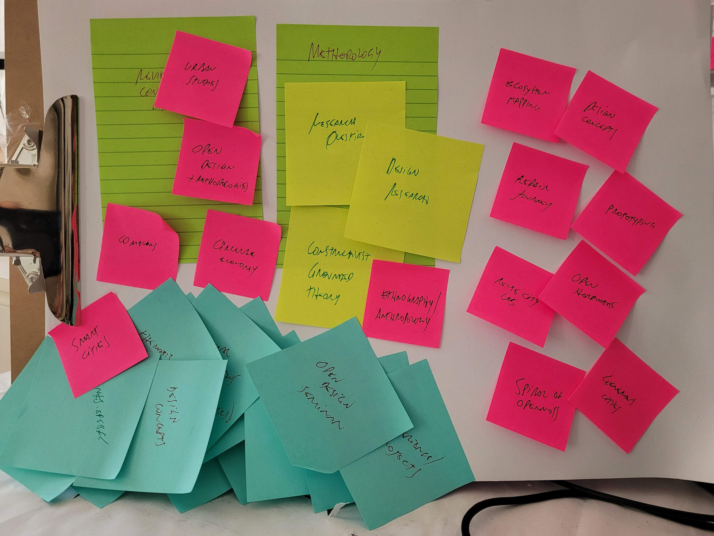

# Annual Progression 2

**Note on 22.12.2021:** This is still a very early draft. It will be improved during the coming weeks until the submission date on 07.01.2022.

My AP2 report will feature:

 1. A depiction of activities performed since AP1, including everything that was included in my OpenDoTT WP2 deliverables as well as other activities.
 2. A description of my thesis structure the way I see it today.

## 1. Activities performed during Y2

*(to be adapted from WP2 deliverables)*

## 2. Thesis structure

### 2.1. A critique of smart cities

I start by adopting a critical take on the meanings and implications of the smart city discourse.

**Summary:** most of the usual depiction of smart cities adopt a very narrow understanding both of what cities are and what "smart(ness?)" means.

I will discuss cities by resorting to literature on urban studies, particularly authors influenced by Henri Lefebrvre's text on the "right to the city". According to this line of thinking, cities are not only physical structures managed by governments and the corporations they hire - whose supposed goal is to seek a contested ideal of "efficiency". Social-economic variables, as well as cultural, environmental and political, must be taken into account in order to understand the dynamics involved in imagining, understanding and transforming contemporary cities (as well and villages and rural areas, by the way). Some references I inted to use to reflect on such issues are:

- The right to the city - Henri Lefebvre.
- Global cities - Saskia Sassen
- Bioregions, John Thackara

I will then address the limitations of the adjective "smart" as applied to cities (as hinted in my WP2 final deliverables). This will be based on critical discussions on smart cities, following references such as the ones below:

- Against the Smart City - Adam Greenfield
- Authors and researchers involved with the seminar Beyond Smart Cities Today (Rotterdam, 2019) - Rob Kitchin, Ayona Datta, Paolo Cardullo and others.

Special attention will be given to re-balancing the narrative about smart (or otherwise better) cities by guaranteeing the (real) participation of local society - in the form of community groups, social enterprises, activits groups, small businesses and others - in decision-making.

### 2.2. Excess materials in the city

In the second part of my thesis I intend to promote critical discussion to the specific topic of waste in contemporary cities. My starting point already is one of overcoming the superficial understanding of waste management towards one of waste prevention. This perspective is informed by literature - both academic and reports by public agencies and nonprofits - proposing that the usual destinations of discarded materials - recycling, incineration and landfilling - all have negative impact in environmental as well as economic aspects. The recent COP-26 in Glasgow can work both as a proof of the urgency of de-carbonising as well as to how much policy discussions are still insufficient - as most of the discourse on waste is still focused in reaching recycling targets.

I will then explore literature and case studies related to different aspects of reuse, in the following topics:

 - Alternative economics
 - Repair and Maintenance
 - Making and Fabrication

#### 2.2.1. Alternative Economics

 - Circular Economy - reports by Ellen Macarthur Foundation, EU and other international bodies
    - Important critical discussion found on "Circular Economy in Developing Countries". Plus my take already expressed in a section of a blog post, "beyond circularity"
 - The value of everything, Mariana Mazzucato - not 100% on-topic, but still important to raise the importance of public investment
 - Doughnut Economy, Kate Raworth
 - Discussion on the commons (Elinor Ostrom and others)

#### 2.2.2. Repair and Maintenance

  - Steven J. Jackson. Rethinking Repair DOI 10.7551/mitpress/9780262525374.003.0011
  - Graham, Thrift. Out of Order: Understanding Repair and Maintenance DOI 10.1177/0263276407075954
  - Campaigns on the right to repair
  - Restart Project
  - Tales of Care and Repair, seminar Nov 2021

#### 2.2.3. Making and Fabrication

 - Making, Tim Ingold

### 2.3. Research Questions

Attempting to frame my theoretical journey. Am I looking to build grounded theory? How and why?

For now (22.12.2021) I am still to decide on one or more of the following (or something else still):

 - skills and abilities around reuse. can technology help?
 - generous cities, on a conceptual take. how to promote them?
 - transformation labs - building blocks of generous cities?
 - spiral of openness - anticolonial take on open design (perhaps the most theoretical of these alternatives).

### 2.4. Methodology

#### 2.4.1 Design research

The bases of my first research studies.

#### 2.4.2. Critical Open Design

 - Open P2P Design - Massimo Menichinelli
 - Post-colonial, decolonial, anticolonial
   - Krenak, Ideas to postpone the end of the world
   - Françoise Vergès, [Capitalocene, Waste, Race, and Gender](https://www.e-flux.com/journal/100/269165/capitalocene-waste-race-and-gender/)

### 2.5. Research studies

 - Year 1
   - Ecosystem Mapping
   - Repair journey
 - Year 2
   - reuse.city

#### 2.5.1. Ecosystem Mapping

#### 2.5.2. Repair journey

#### 2.5.3. reuse.city online co-design lab

 - [reuse city lab](reuse-city-lab.md)

### 2.6. Prototyping

From studies to concept ideas, to prototyping. Eight original concept ideas, three derived concepts in the second year.

Discussion about the relevance of prototyping and its limitations:

 - Gambiarra: the prototyping perspective, Gabriel Menotti.

Open hardware. Privacy by design.

My prototypes: thingwiki, E-I,reuse.city, transformation labs

#### 2.6.1. ThingWiki

Universal Registry of Things in the form of wiki

#### 2.6.2. E-I

Repair assistant

#### 2.6.3. reuse.city

Proto-community

#### 2.6.4. Transformation Labs

Will they even become a prototype? Not sure yet. Perhaps the idea of "blueprint". Not sure if this is relevant.

### 2.7. Analysing research outputs

Coding and presenting findings, insights, discussions.

### 2.8. Final discussion

#### 2.8.1. Spiral of Openness

My anticolonial take on open design. Theorising from my own notes.

 - Constructivist Grounded Theory, Kathy Charmaz

#### 2.8.2. Generous Cities

How to interpret excess material in cities and regions as a resource - potential value - to benefit local society? How to promote a shift from abundance (passively profiting from excess) to generosity (the intentional decision to care for others)?

Ethnographic account of my experience while moving to different countries twice (and visiting others), facing significantly different cultures of re-use. How has that impacted my understandig and changed my research questions? What have I produced in terms of concepts and policy recommendations (expected outcome of OpenDoTT, is it)?

**Note:** obviously, some parts are still missing. The next training module on policy and legislation will possibly reorient my goals.
