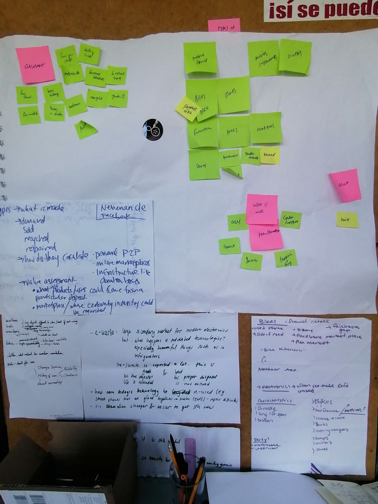

Soon after we moved to Berlin last September I had the chance to host a workshop called "Hacking waste management for the smart city" (originally "Reusing things in the smart city", but apparently that title did not attract many participants) at the [Data Cities Conference](https://www.disruptionlab.org/data-cities) organized by Disruption Network Lab:

## Workshop 3: Reuse, Recycle, Repair - Hacking waste management for the smart city

> **With:** Felipe Schmidt Fonseca (Activist, Free/Open Advocate and Researcher, OpenDoTT project, BR/DE).

> Reducing consumption and reusing materials contribute decisively to prevent the generation of waste. As well as the obvious environmental benefits, the reuse through repair, re-circulation and upcycling has positive social and economic outcomes for society at large. However, smart city projects seldom take into account the reuse of materials as part of their solutions for waste management. This workshops tries to advance the idea of a reuse commons and discuss what would be its implications in terms of data generation and governance, decision-making and privacy.

I did a brief presentation of my research so far, and had the opportunity to dive quickly into the vibrant culture of reuse in Berlin. The participants helped me acquire an overview of what kinds of second-hand materials are exchanged in Berlin and the main channels through which that takes place. The outputs of the workshop still decorate my home office desk to this day.

